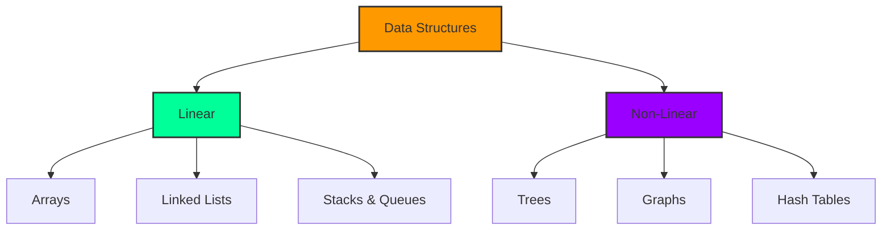
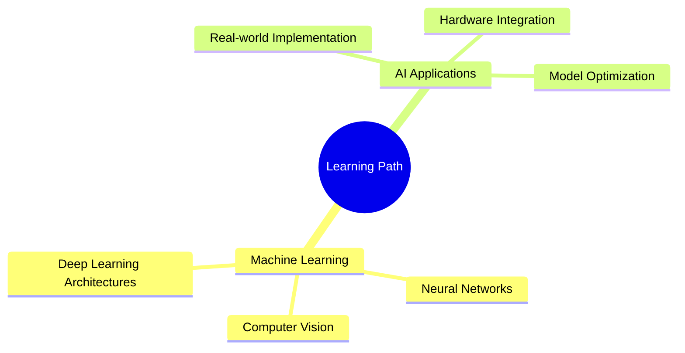

<div align="center">
  
# Hello World! I'm B M Pranav 👋
### AI/ML Engineer in Progress | Tech Explorer | Problem Solver

<a href="https://github.com/Pranavbm10"></a>
[](https://github.com/Pranavbm10)


</div>

---


### 🎓 About Me

- 👨‍🎓 B.Tech in **Artificial Intelligence and Machine Learning** at MSRIT, Bengaluru
- 🔬 Currently working on **FAER Project**: Revolutionary assistive device for the visually impaired
- 🌱 Learning **Machine Learning** and **Deep Learning**
- 🎯 Goal: Building AI solutions that make a real-world impact
- 💡 Love participating in hackathons and innovation challenges
- 📧 Reach me: **pranavbm2004@gmail.com**

---

### 🏆 Achievements & Certifications

<div align="left">

```typescript
const achievements = {
    certifications: [
        "UiPath Professional Diploma",
        "Infosys Certified - Computer Organization Architecture"
    ],
    competitions: [
        "FAER Project Competition Finalist",
        "CodeRIT Hackathon Winner",
        "GDC Hackathon Winner"
    ],
    current_focus: "Building Assistive Technologies with AI"
};
```

</div>

---

### 🛠️ Tech Stack & Tools

#### Languages & Frameworks


#### AI/ML Tools


#### Development Tools


---

### 📊 Data Structures & Algorithms



#### Problem Solving Stats
[](https://leetcode.com/u/pranavbmleo/)

---

### 🚀 Featured Projects

<div align="center">

<a href="https://github.com/Pranavbm10/smart-hat">
  
</a>
<a href="https://github.com/Pranavbm10/maze-runner">
  
</a>

</div>

#### 🧠 Assistive Smart Hat
- **Tech Stack**: `YOLOv8` `Raspberry Pi` `OpenCV` `TensorFlow`
- **Status**: 🟢 Active Development
- **Features**: Real-time object detection, OCR, Scene narration
- Demo: [View Demo](https://github.com/Pranavbm10/smart-hat)

#### 🎮 Maze Runner Game
- **Tech Stack**: `Flutter` `Dart` `Firebase`
- **Status**: ✅ Completed
- **Features**: Dynamic maze generation, Real-time scoring
- Demo: [Play Game](https://github.com/Pranavbm10/maze-runner)

#### 🏛️ Institutions & Constitution
- **Tech Stack**: `Flutter` `Firebase` `Gamification API`
- **Status**: ✅ Completed
- **Features**: Interactive learning, Progress tracking
- Link: [Learn More](https://github.com/Pranavbm10/constitution-game)

#### 👗 Fashion Recommender App
- **Tech Stack**: `TensorFlow` `Flask` `React Native`
- **Status**: 🟡 In Progress
- **Features**: AI styling, Personalized recommendations
- Preview: [Coming Soon]()

---

### 📊 GitHub Analytics

<div align="center">
  <picture>
    <source 
      srcset="https://github-readme-stats.vercel.app/api?username=Pranavbm10&show_icons=true&theme=radical&include_all_commits=true&count_private=true"
      media="(prefers-color-scheme: dark)"
    />
    <source
      srcset="https://github-readme-stats.vercel.app/api?username=Pranavbm10&show_icons=true&theme=radical&include_all_commits=true&count_private=true"
      media="(prefers-color-scheme: light), (prefers-color-scheme: no-preference)"
    />
    
  </picture>

  <picture>
    <source 
      srcset="https://streak-stats.demolab.com?user=Pranavbm10&theme=radical"
      media="(prefers-color-scheme: dark)"
    />
    <source
      srcset="https://streak-stats.demolab.com?user=Pranavbm10&theme=radical"
      media="(prefers-color-scheme: light), (prefers-color-scheme: no-preference)"
    />
    
  </picture>
</div>

<div align="center">
  <picture>
    <source 
      srcset="https://github-readme-activity-graph.vercel.app/graph?username=Pranavbm10&theme=redical&hide_border=true"
      media="(prefers-color-scheme: dark)"
    />
    <source
      srcset="https://github-readme-activity-graph.vercel.app/graph?username=Pranavbm10&theme=redical&hide_border=true"
      media="(prefers-color-scheme: light), (prefers-color-scheme: no-preference)"
    />
    
  </picture>
</div>

---

### 🎯 Current Learning Goals



---

### 🤝 Connect With Me

<div align="center">
  
[](mailto:pranavbm2004@gmail.com)
[](https://www.linkedin.com/in/pranav-bm)
[](https://github.com/Pranavbm10)

</div>

---

<div align="center">
  
### 💭 Random Dev Quote


</div>

<div align="center">
  
</div>

---

<p align="center">✨ If you like my projects, Give them ⭐ and Share them!</p>
